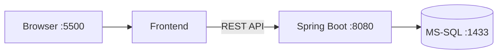
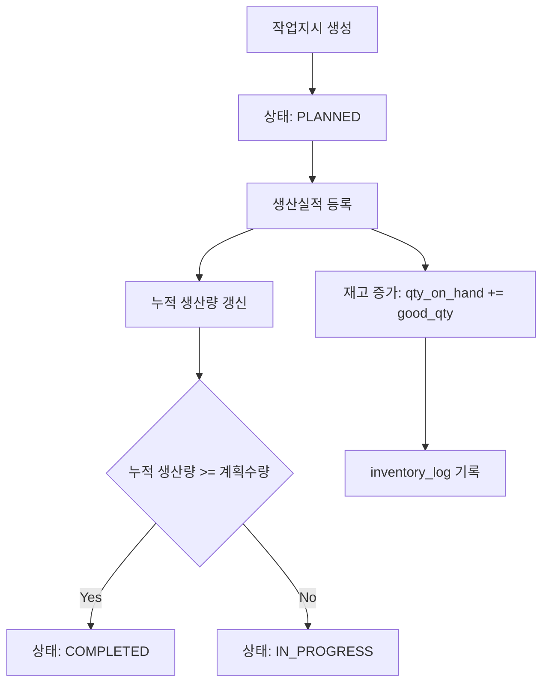

# Mini MES

생산 실행 단계의 핵심인 **작업지시-생산실적-재고 수불**을 하나의 흐름으로 구현한 프로젝트입니다.  
목표는 생산 실적 등록 시점에 재고 반영과 이력 기록을 트랜잭션으로 묶어 데이터 정합성을 유지하는 것입니다.

---

## 1. 구현 목표와 반영 내용
- 작업지시 생성 및 상태 관리 (`PLANNED`, `IN_PROGRESS`, `COMPLETED`)
- 생산실적 등록 시 누적 생산량 자동 갱신
- 양품 수량 기준 재고 증가 처리
- 재고 변경 이력(`inventory_log`) 기록
- 조회 API 제공 (작업지시/실적/재고/기준정보)
- Docker Compose 기반 DB 실행 환경 구성
- GitHub Actions 기반 백엔드 CI 구성

---

## 2. 기술 스택
- **Backend**: Java 17, Spring Boot 3.3, Spring Data JPA, Spring Security
- **Database**: Microsoft SQL Server 2022
- **Frontend**: HTML, CSS, Vanilla JavaScript
- **Infra**: Docker, Docker Compose
- **CI**: GitHub Actions (Maven build/test)

---

## 3. 시스템 아키텍처


---

## 4. 수불/재고 처리 Flow


---

## 5. 핵심 API
- `GET /api/v1/health`
- `GET /api/v1/work-orders`
- `POST /api/v1/work-orders`
- `GET /api/v1/production-results`
- `POST /api/v1/production-results`
- `GET /api/v1/inventories/{productId}`
- `GET /api/v1/products`
- `GET /api/v1/processes`

---

## 6. 보안 적용 내역 (회사 제출용)

### 6.1 민감정보 Git 업로드 방지
- `.env`, `.env.*`, 키 파일(`*.pem`, `*.key`, `*.p12`, `*.jks`)은 `.gitignore`로 차단
- 로컬 실행용 샘플만 `.env.example`로 제공
- DB 계정/비밀번호는 **환경변수 주입 방식** (`DB_PASSWORD`, `MSSQL_SA_PASSWORD`)

### 6.2 백엔드 보안 기본 강화
- Spring Security 적용 (`spring-boot-starter-security`)
- 무상태 세션(`STATELESS`) 설정
- 불필요한 인증 방식 비활성화 (`httpBasic`, `formLogin` 비활성)
- 보안 헤더 기본 적용
  - `X-Content-Type-Options`
  - `X-Frame-Options: DENY`
  - `Referrer-Policy: no-referrer`

### 6.3 CORS 제한
- 과거 `allowedOrigins("*")` 제거
- `app.cors.allowed-origins` 환경변수 기반 화이트리스트 방식 적용
- 기본값은 로컬 개발 주소(`http://localhost:5500`)만 허용

### 6.4 입력 검증 및 오류 응답 표준화
- 요청 DTO에 Bean Validation 적용 (`@NotNull`, `@Min`, `@Pattern`, `@Size`)
- `GlobalExceptionHandler`에서 검증 오류/업무 오류/예외 오류를 표준 포맷으로 반환
- 내부 예외 상세는 외부에 노출하지 않음 (`Internal server error` 고정)

### 6.5 로그 노출 최소화
- SQL 상세 출력 레벨을 `warn`으로 하향
- 운영 시 민감정보 로그 노출 가능성 축소

---

## 7. 보안 증적(검증 기록)

아래 명령으로 점검합니다.

```bash
# 1) 민감 파일 Git 추적 여부 점검
cd /home/xkak9/projects/mes-project
git ls-files | grep -E '^\.env$|\.pem$|\.key$|\.p12$|\.jks$'
# 기대결과: 출력 없음

# 2) CORS 와일드카드 사용 금지 점검
grep -RIn 'allowedOrigins\("\*"\)' backend/src/main/java
# 기대결과: 출력 없음

# 3) 환경변수 기반 비밀번호 주입 점검
grep -n 'password:' backend/src/main/resources/application.yml
# 기대결과: password: ${DB_PASSWORD}

# 4) 테스트/빌드 검증
cd backend
mvn -B test
mvn -B -DskipTests package
```

> 참고: `.env.example`는 샘플 파일이며, 실제 비밀번호는 절대 커밋하지 않습니다.

---

## 8. 실행 방법

### 8.1 환경변수 파일 준비
```bash
cp .env.example .env
# .env 열어서 강한 비밀번호로 변경
```

### 8.2 DB 실행
```bash
docker compose up -d
docker compose ps
```

### 8.3 백엔드 실행
```bash
cd backend
mvn spring-boot:run
```

### 8.4 프론트 실행
```bash
cd frontend
python3 -m http.server 5500
```

### 8.5 종료
```bash
docker compose down
# 데이터까지 제거
docker compose down -v
```

---

## 9. 유지보수 가이드 (요약)
- 비즈니스 로직은 `service` 계층에만 작성
- `controller`는 입출력/검증 위주로 단순화
- 핵심 로직에는 한국어 주석으로 의도 기록
- 신규 기능 추가 시 필수
  1. DTO 검증 규칙 작성
  2. 서비스 단위 테스트 추가
  3. README 보안 체크리스트 갱신

---

## 10. 프로젝트 구조
```text
mes-project/
├─ backend/
├─ frontend/
├─ captures/
├─ docs/
├─ scripts/
├─ docker-compose.yml
├─ .env.example
├─ .github/workflows/backend-ci.yml
└─ README.md
```
