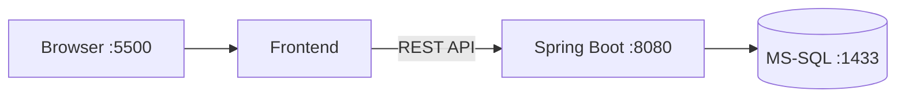
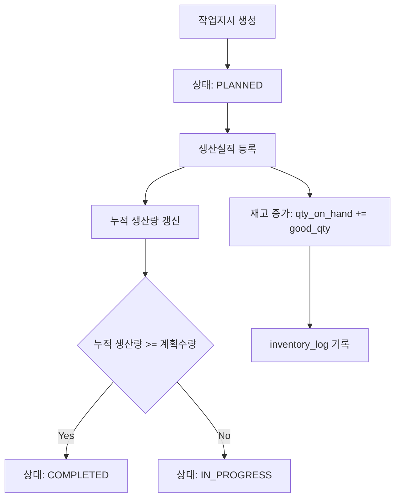
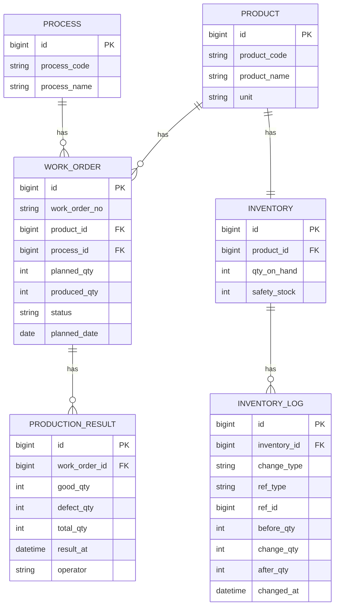

# Mini MES

생산 실행 단계의 핵심인 **작업지시-생산실적-재고 수불**을 하나의 흐름으로 구현한 프로젝트입니다.  
목표는 생산 실적 등록 시점에 재고 반영과 이력 기록을 트랜잭션으로 묶어 데이터 정합성을 유지하는 것입니다.

---

## 1. 구현 목표와 반영 내용
- 작업지시 생성 및 상태 관리 (`PLANNED`, `IN_PROGRESS`, `COMPLETED`)
- 생산실적 등록 시 누적 생산량 자동 갱신
- 양품 수량 기준 재고 증가 처리
- 재고 변경 이력(`inventory_log`) 기록
- 조회 API 제공 (작업지시/실적/재고/기준정보)
- Docker Compose 기반 DB 실행 환경 구성
- GitHub Actions 기반 백엔드 CI 구성

---

## 2. 기술 스택
- **Backend**: Java 17, Spring Boot 3.3, Spring Data JPA
- **Database**: Microsoft SQL Server 2022
- **Frontend**: HTML, CSS, Vanilla JavaScript
- **Infra**: Docker, Docker Compose
- **CI**: GitHub Actions (Maven build/test)

---

## 3. 시스템 아키텍처


---

## 4. 수불/재고 처리 Flow


---

## 5. ERD


---

## 6. 주요 기능
### 6.1 작업지시
- 작업지시 등록/조회
- 계획수량 기반 상태 추적

### 6.2 생산실적
- 양품/불량/작업자/시각 등록
- 등록 시 작업지시 누적 생산량 자동 반영
- 작업자가 화면 우측의 **공정 흐름 패널**에서 현재 단계(PLANNED/IN_PROGRESS/COMPLETED) 즉시 확인 가능

### 6.3 재고 및 이력
- 양품 수량 기준 재고 증가
- 이력 테이블에 변경 전/후 수량 기록

### 6.4 현장 모니터링 UI
- KPI 카드(작업지시 수, 진행 공정, 양품 누적, 불량률)
- 공정 흐름 패널(PLANNED → IN_PROGRESS → COMPLETED)
- 작업자 알림 영역(안전재고/불량률/대기 지시 경고)
- 최근 수불 로그 테이블

---

## 7. 주요 화면
### 7.1 메인 대시보드


### 7.2 작업지시 등록


### 7.3 생산실적 등록


### 7.4 재고 반영 확인


### 7.5 완료 상태 및 이력 확인


---

## 8. 실행 방법
### 8.1 DB 실행
```bash
docker compose up -d
docker compose ps
```

### 8.2 DB 생성/스키마 적용
```bash
docker exec -it mes-mssql /opt/mssql-tools18/bin/sqlcmd -S localhost -U sa -P "$MSSQL_SA_PASSWORD" -C -Q "IF DB_ID('mini_mes') IS NULL CREATE DATABASE mini_mes;"

docker exec -i mes-mssql /opt/mssql-tools18/bin/sqlcmd -S localhost -U sa -P "$MSSQL_SA_PASSWORD" -C -I -d mini_mes -b < ./sql/01_schema.sql
docker exec -i mes-mssql /opt/mssql-tools18/bin/sqlcmd -S localhost -U sa -P "$MSSQL_SA_PASSWORD" -C -I -d mini_mes -b < ./sql/02_seed.sql
```

### 8.3 백엔드 실행
```bash
cd backend
mvn spring-boot:run
```

### 8.4 프론트 실행
```bash
cd frontend
python3 -m http.server 5500
```

### 8.5 종료
```bash
docker compose down
# 데이터까지 제거
docker compose down -v
```

---

## 9. API 요약
- `GET /api/v1/health`
- `GET /api/v1/work-orders`
- `POST /api/v1/work-orders`
- `GET /api/v1/production-results`
- `POST /api/v1/production-results`
- `GET /api/v1/inventories/{productId}`
- `GET /api/v1/products`
- `GET /api/v1/processes`

---

## 10. 프로젝트 구조
```text
mes-project/
├─ backend/
├─ frontend/
├─ captures/
├─ docs/
├─ scripts/
├─ docker-compose.yml
├─ .github/workflows/backend-ci.yml
└─ README.md
```
