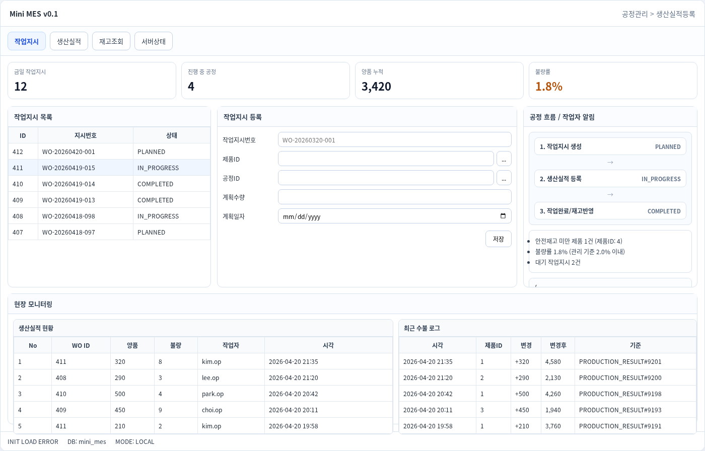
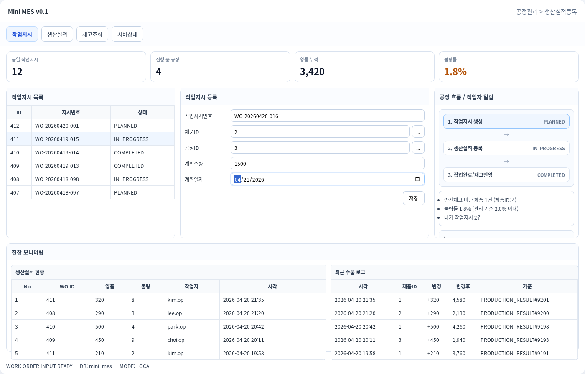
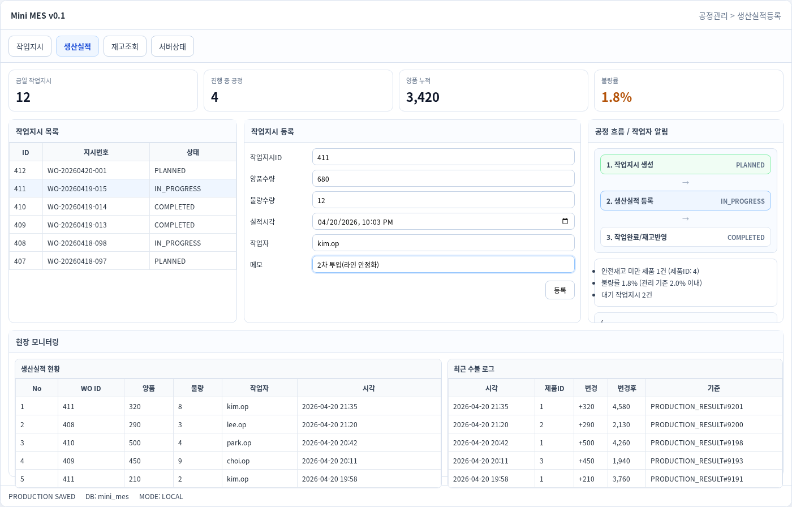
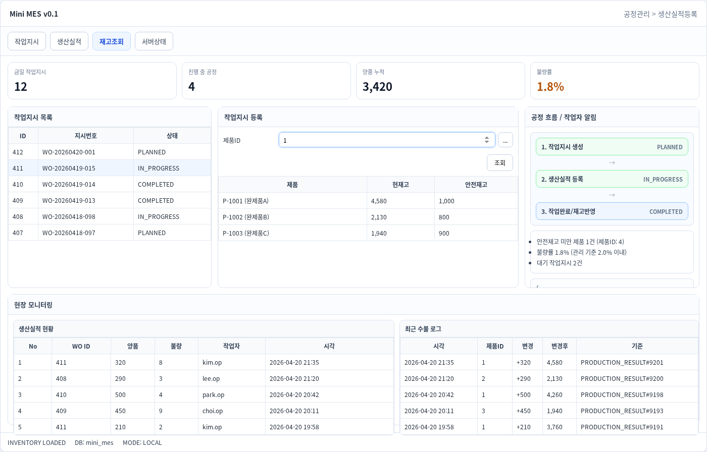
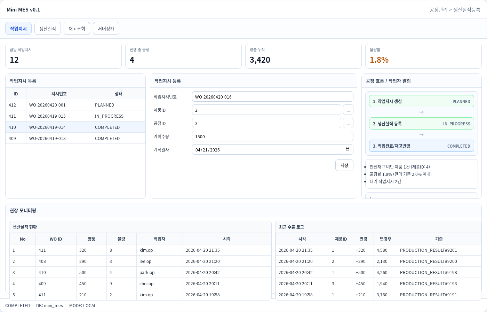
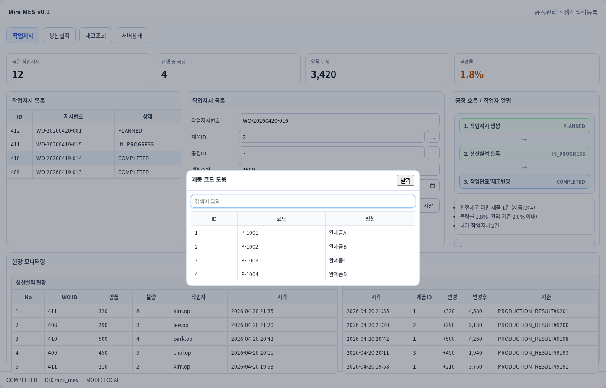

# Mini MES

생산 실행 단계의 핵심인 **작업지시 → 생산실적 → 재고 수불** 흐름을 트랜잭션으로 묶어 구현한 프로젝트입니다.

---

## 1) 프로젝트 목표
- 작업지시/생산실적/재고 반영의 데이터 정합성 보장
- 코드 가독성과 유지보수성 확보(레이어 책임 분리 + 한국어 주석)
- 민감정보 보호, API 접근 통제, 감사 추적 등 기본 보안 체계 확보
- 팀원이 README만 보고도 실행/점검/검증 가능한 상태 제공

---

## 2) 기술 스택
- **Backend**: Java 17, Spring Boot 3.3, Spring Data JPA, Spring Security
- **Database**: Microsoft SQL Server 2022
- **Frontend**: HTML, CSS, Vanilla JavaScript
- **Infra**: Docker, Docker Compose
- **CI**: GitHub Actions (Maven build/test)

---

## 3) 핵심 기능
- 작업지시 생성/조회 및 상태 관리 (`PLANNED`, `IN_PROGRESS`, `COMPLETED`)
- 생산실적 등록 시 누적 생산량 자동 반영
- 양품 수량 기준 재고 증가
- 수불 이력(`inventory_log`) 자동 기록
- 현장 대시보드(KPI/알림/수불로그/흐름 시각화)

---

## 4) 보안 및 유지보수 강화 내용

### 4.1 보안
1. **민감정보 분리**
   - `.env`는 Git 커밋 금지
   - `.env.example`만 커밋하여 환경변수 템플릿 제공

2. **API 보호 옵션**
   - `APP_REQUIRE_API_KEY=true` 시 쓰기 API(POST/PUT/PATCH/DELETE) 보호
   - `X-API-KEY`, `X-USER-ID`, `X-USER-ROLE` 헤더 기반 인증/권한 처리
   - 쓰기 권한 역할은 `APP_WRITE_ROLES`로 제어

3. **CORS 화이트리스트**
   - `allowedOrigins("*")` 제거
   - `APP_CORS_ALLOWED_ORIGINS` 값만 허용

4. **보안 헤더 및 무상태 세션**
   - Stateless 세션 고정
   - `X-Frame-Options`, `Referrer-Policy` 등 기본 헤더 적용

5. **감사(Audit) 로그 필터**
   - 요청마다 `traceId` 발급 (`X-Trace-Id` 응답 헤더)
   - method/path/status/user/ip/elapsedMs 기록
   - 바디/토큰/비밀번호 등 민감정보는 로그 미기록

### 4.2 유지보수
- Controller는 입출력, Service는 비즈니스 로직으로 역할 분리
- 핵심 처리 코드에 짧은 한국어 주석 추가(의도 중심)
- DTO 검증 강화(`@Pattern`, `@Size`, `@Min`, `@NotNull`)
- 표준 오류 응답 + 내부 예외 상세 은닉

### 4.3 프론트 운영 유연성
- `window.__API_BASE__`, `window.__API_KEY__`, `window.__USER_ID__`, `window.__USER_ROLE__` 지원
- 운영/스테이징에서 코드 수정 없이 주입값으로 연결 가능

---

## 5) 실행 방법

### 5.1 환경변수 준비
```bash
cd /home/xkak9/projects/mes-project
cp .env.example .env
# .env 값 수정(특히 비밀번호/API KEY)
```

### 5.2 DB 실행
```bash
docker compose up -d
docker compose ps
```

### 5.3 백엔드 실행
```bash
cd backend
mvn spring-boot:run
```

### 5.4 프론트 실행
```bash
cd frontend
python3 -m http.server 5500
```

### 5.5 종료
```bash
docker compose down
# 볼륨까지 삭제
# docker compose down -v
```

---

## 6) API 요약
- `GET /api/v1/health`
- `GET /api/v1/work-orders`
- `POST /api/v1/work-orders`
- `GET /api/v1/production-results`
- `POST /api/v1/production-results`
- `GET /api/v1/inventories/{productId}`
- `GET /api/v1/products`
- `GET /api/v1/processes`

---

## 7) 증적(검증/감사) 체크리스트

### 7.1 Git 민감정보 추적 차단 확인
```bash
cd /home/xkak9/projects/mes-project
git ls-files -- .env
# 기대결과: 출력 없음
```

### 7.2 CORS 와일드카드 미사용 확인
```bash
grep -RIn 'allowedOrigins\("\*"\)' backend/src/main/java
# 기대결과: 출력 없음
```

### 7.3 보안 설정값 확인
```bash
grep -n 'require-api-key\|api-key\|write-roles' backend/src/main/resources/application.yml
```

### 7.4 감사 로그 확인
```bash
# 백엔드 실행 로그에서 아래 패턴 확인
[AUDIT] traceId=xxxx method=POST path=/api/v1/production-results status=201 user=... elapsedMs=...
```

### 7.5 테스트/빌드
```bash
cd /home/xkak9/projects/mes-project/backend
mvn -B test
mvn -B -DskipTests package
```

---

## 8) 화면 캡처 증적 자료

### 8.1 메인 대시보드


### 8.2 작업지시 등록


### 8.3 생산실적 등록


### 8.4 재고 조회


### 8.5 완료 상태 및 수불 로그


### 8.6 코드 도움(Lookup) 모달


---

## 9) 프로젝트 구조
```text
mes-project/
├─ backend/
│  ├─ src/main/java/com/mesproject/
│  │  ├─ config/ (WebConfig, SecurityConfig, AppSecurityProperties)
│  │  ├─ security/ (ApiKeyAuthenticationFilter, RequestAuditFilter)
│  │  ├─ service/ (핵심 비즈니스 로직)
│  │  └─ ...
├─ frontend/
├─ docs/
├─ scripts/
├─ captures/
├─ docker-compose.yml
├─ .env.example
└─ README.md
```
